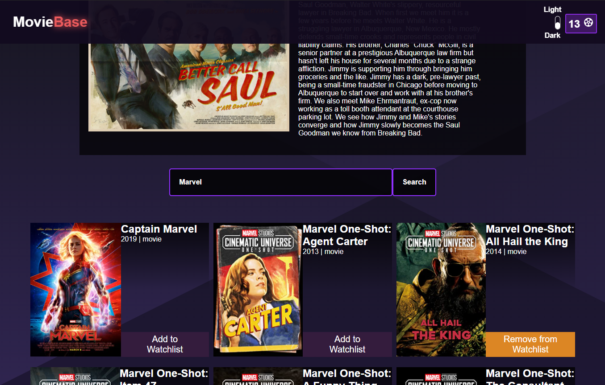

# Movie Base

  

## About

###### This is application allows users to search movies and view relevant information.

###### The way the application save data is by utilizing the local storage and by manippulating the way data is stored. Local storage allows us to save data in a plain text format.

## Technologies Used

- ###### HTML
- ###### CSS
- ###### Javascript
- ###### Vue.js

## Technical Information

### To run the site on your local machine

If you wish to run this locally you will to first need clone this repository to your local machine. Afterwards you will have to run npm install inside both the client and server folders for all the necessary dependencies to be installed. For the backend you will have to run the command npm start inside the server folder. The server will run on “http://localhost:5000/”. As for the Frontend you will need to run the command npm start inside the client folder. After that when all the configurations are done a new window should open automatically on your browser displaying the client side of the app which runs on “http://localhost:3000/”.
